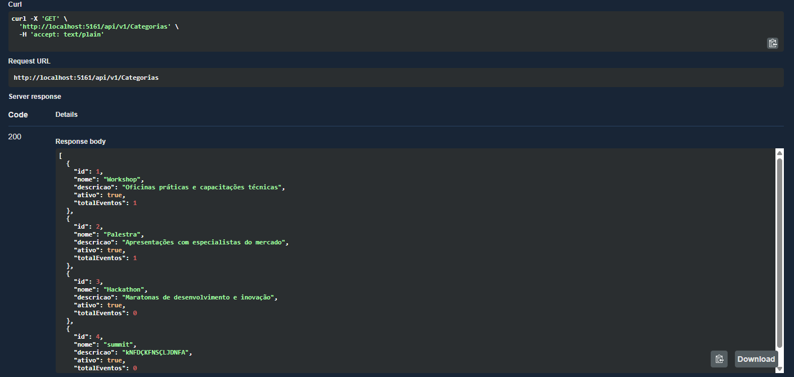
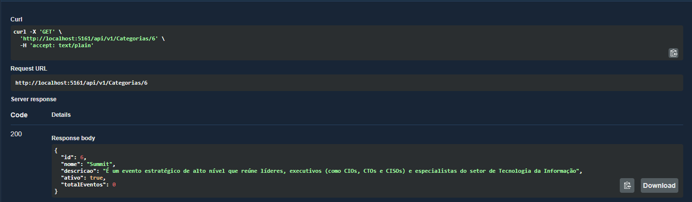
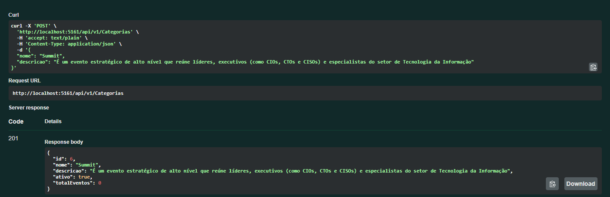
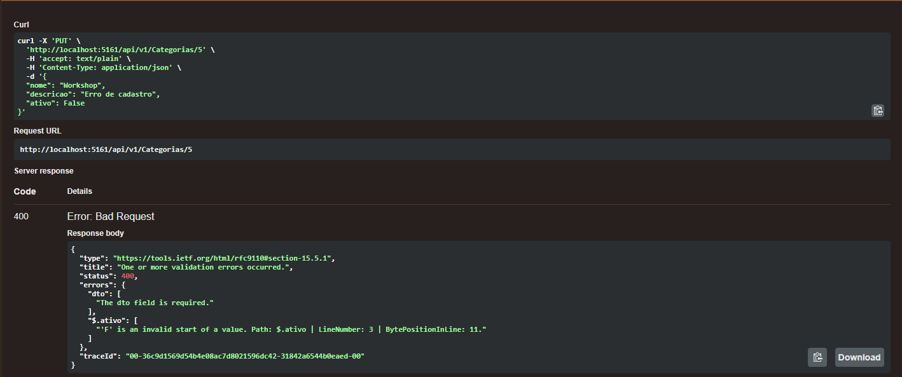
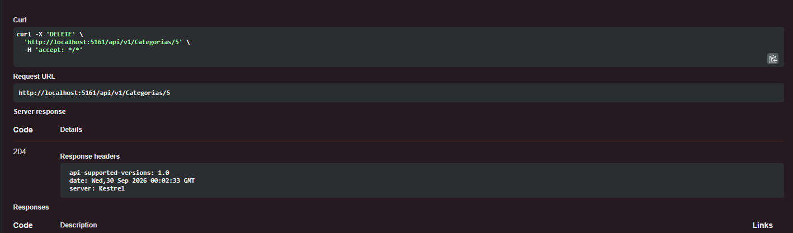
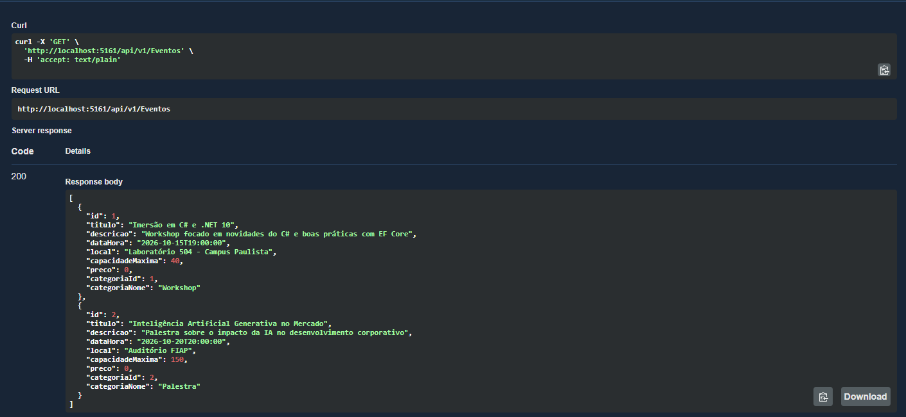
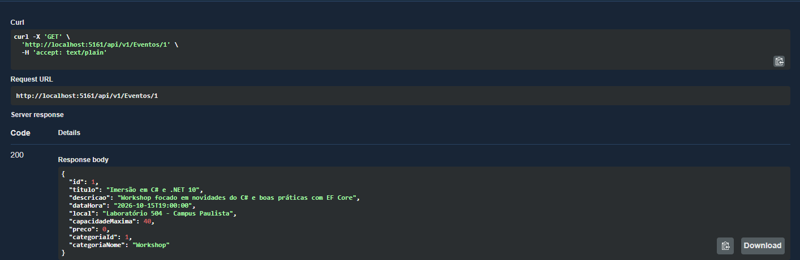
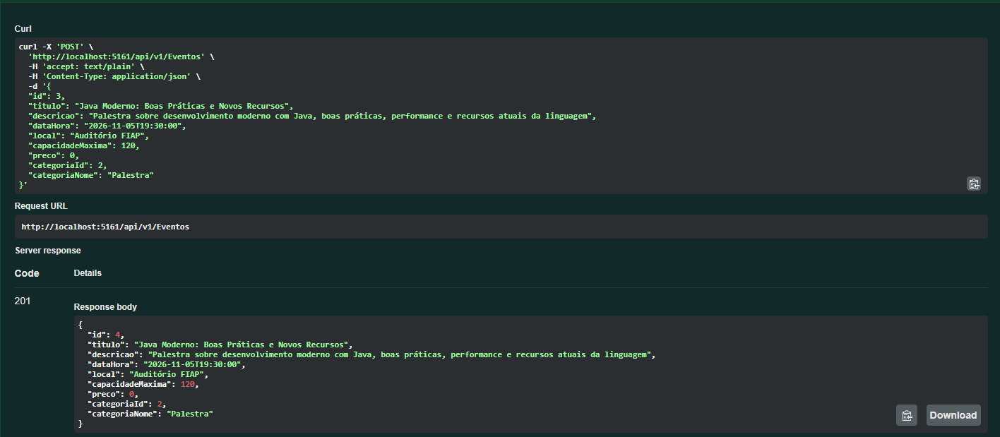
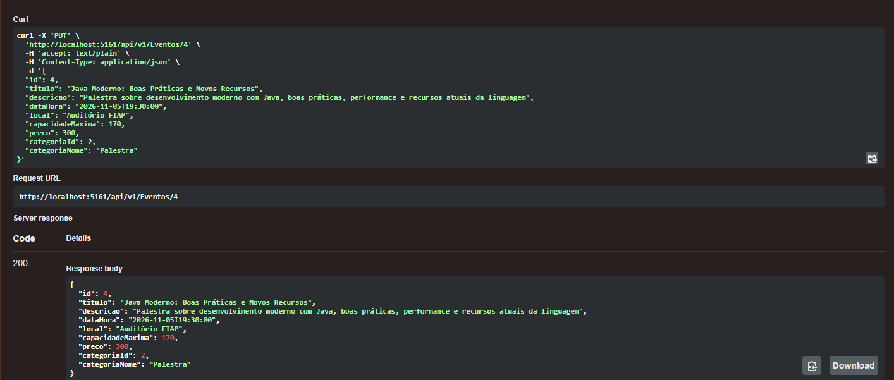
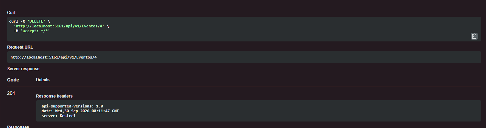

# 🎓 CampusEventos API

> **Disciplina:** C# Software Development  
> **Tema:** Livre — Gestão de Eventos Acadêmicos e Workshops  
> **Tecnologias:** C# .NET 10, ASP.NET Core Web API, Entity Framework Core, SQLite  

---

## 👥 Integrantes do Grupo

| RM | Nome Completo |
|---|---|
| RM556006 | Denise Senise |
| RM554517 | Larissa Lapa |
| RM557803 | Mateus Leme |
| RM556020 | David Fernandes |
| RM559097 | Vinicius Prestes |


---

## 📌 Contexto do Projeto

### O que é?
A **CampusEventos API** é uma API RESTful desenvolvida para gerenciar o ciclo de vida de eventos acadêmicos, palestras, workshops e hackathons realizados em ambiente universitário ou corporativo.

### Qual problema resolve?
A organização de eventos acadêmicos frequentemente sofre com a falta de centralização: informações desatualizadas sobre locais e horários, dificuldade em controlar a capacidade das salas/laboratórios e falta de categorização das atividades. A API resolve esse problema oferecendo um catálogo padronizado onde organizadores podem criar, consultar, atualizar e cancelar eventos com controle de vagas e categorização estruturada.

### Para quem é destinado?
- **Coordenadores e organizadores de eventos acadêmicos:** para cadastrar salas, horários, capacidade e descrições das atividades.
- **Alunos e participantes:** para consultar a agenda de workshops, palestras e conferências disponíveis no campus.

---

## 🗄️ Banco de Dados

- **SGBD Utilizado:** SQLite
- **ORM:** Entity Framework Core (`Microsoft.EntityFrameworkCore.Sqlite` v10.0.12)
- **Arquivo do Banco:** `campuseventos.db` (gerado localmente na raiz do projeto)
- **Vantagens da escolha:**
  - **Zero Configuração:** O avaliador não precisa instalar SGBDs externos, Docker ou configurar credenciais de rede/firewall.
  - **Auto-provisionamento:** A API aplica automaticamente as Migrations na inicialização, gerando o arquivo `.db` e a carga inicial (*Seed Data*) de categorias e eventos.
- **Tabelas Mapeadas:**
  - `TB_CATEGORIAS`: Armazena as categorias dos eventos (ex: Palestra, Workshop, Hackathon).
  - `TB_EVENTOS`: Armazena os eventos, com chave estrangeira (`CategoriaId`) vinculada a `TB_CATEGORIAS`.

---

## ⚙️ Configuração da Conexão

A string de conexão está configurada no arquivo [`CampusEventos.Api/appsettings.json`](file:///c:/Users/labsfiap/Desktop/CP05%20-%20C/CampusEventos.Api/appsettings.json):

```json
{
  "ConnectionStrings": {
    "DefaultConnection": "Data Source=campuseventos.db"
  }
}
```

Nenhuma alteração é necessária para rodar o projeto localmente.

---

## 🚀 Como Executar o Projeto Localmente

### Pré-requisitos
- [.NET SDK 10](https://dotnet.microsoft.com/download) instalado no computador.

### Passo a Passo

1. **Restaurar as dependências:**
   ```bash
   dotnet restore
   ```

2. **Compilar a solução:**
   ```bash
   dotnet build
   ```

3. **Executar a API:**
   ```bash
   dotnet run --project CampusEventos.Api
   ```
   *(Na primeira execução, o banco SQLite `campuseventos.db` será criado automaticamente e populado com os dados iniciais de teste).*

4. **Acessar a documentação interativa (Swagger UI):**
   Abra o navegador no endereço:
   - 👉 **http://localhost:5161/swagger**
   - ou **https://localhost:7188/swagger**

---

## 🔄 Versionamento da API

A API implementa versionamento oficial via pacote `Asp.Versioning.Mvc`, com padrão de rotas explícitas `/api/v{version}/[controller]`.

- **Versão Atual:** `v1`
- **Rotas:**
  - `/api/v1/categorias`
  - `/api/v1/eventos`

---

## 🛣️ Endpoints Disponíveis

### 📂 Categorias (`/api/v1/categorias`)

| Método | Rota | Descrição | Status Codes |
|---|---|---|---|
| `GET` | `/api/v1/categorias` | Lista todas as categorias cadastradas com total de eventos vinculados | `200 OK` |
| `GET` | `/api/v1/categorias/{id}` | Busca os dados de uma categoria específica por ID | `200 OK`, `404 Not Found` |
| `POST` | `/api/v1/categorias` | Cadastra uma nova categoria | `201 Created`, `400 Bad Request` |
| `PUT` | `/api/v1/categorias/{id}` | Atualiza o nome, descrição ou status ativo de uma categoria | `200 OK`, `400 Bad Request`, `404 Not Found` |
| `DELETE` | `/api/v1/categorias/{id}` | Exclui uma categoria (apenas se não houver eventos vinculados a ela) | `204 No Content`, `400 Bad Request`, `404 Not Found` |

### 📅 Eventos (`/api/v1/eventos`)

| Método | Rota | Descrição | Status Codes |
|---|---|---|---|
| `GET` | `/api/v1/eventos` | Lista todos os eventos ordenados por data. Permite filtros opcionais por `termo` (busca em título/descrição) e `categoriaId` | `200 OK` |
| `GET` | `/api/v1/eventos/{id}` | Busca os dados detalhados de um evento específico por ID | `200 OK`, `404 Not Found` |
| `POST` | `/api/v1/eventos` | Cria um novo evento (valida existência da categoria e capacidade positiva) | `201 Created`, `400 Bad Request` |
| `PUT` | `/api/v1/eventos/{id}` | Atualiza os dados de um evento existente | `200 OK`, `400 Bad Request`, `404 Not Found` |
| `DELETE` | `/api/v1/eventos/{id}` | Exclui um evento do sistema | `204 No Content`, `404 Not Found` |

---

## 📦 Exemplos de Payloads (JSON)

### Criar Categoria (`POST /api/v1/categorias`)
```json
{
  "nome": "Minicurso",
  "descricao": "Cursos rápidos e práticos para estudantes"
}
```

### Criar Evento (`POST /api/v1/eventos`)
```json
{
  "titulo": "Workshop de C# e Entity Framework",
  "descricao": "Capacitação prática em APIs REST com .NET 10 e SQLite",
  "dataHora": "2026-10-25T19:00:00",
  "local": "Laboratório 502 - Campus Paulista",
  "capacidadeMaxima": 45,
  "preco": 0.0,
  "categoriaId": 1
}
```

---

## 🗃️ Migrations Documentadas

A migração foi gerada utilizando o Entity Framework Core CLI e está versionada na pasta [`CampusEventos.Api/Migrations`](file:///c:/Users/labsfiap/Desktop/CP05%20-%20C/CampusEventos.Api/Migrations):

- `20260929231204_InitialCreate.cs`: Contém as instruções DDL para criação das tabelas `TB_CATEGORIAS` e `TB_EVENTOS`, chaves primárias, chave estrangeira com restrição de exclusão e inserção dos dados iniciais (*Seed*).

Comando utilizado para criação da migração:
```bash
dotnet ef migrations add InitialCreate --project CampusEventos.Api
```

Comando para aplicar manualmente (opcional, pois a API já aplica na inicialização):
```bash
dotnet ef database update --project CampusEventos.Api
```

---

## 📸 Evidências de Testes

Abaixo estão registradas as evidências de teste realizadas no **Swagger UI**, comprovando o funcionamento e os status codes de cada endpoint da API.

---

### 📂 Endpoints de Categorias (`/api/v1/categorias`)

#### 1. `GET /api/v1/categorias` — Listar todas as categorias
> Retorna status code `200 OK` com a listagem de categorias e a contagem de eventos vinculados.



---

#### 2. `GET /api/v1/categorias/{id}` — Buscar categoria por ID
> Retorna status code `200 OK` com os detalhes da categoria informada.



---

#### 3. `POST /api/v1/categorias` — Cadastrar nova categoria
> Retorna status code `201 Created` com o header `Location` apontando para o novo recurso criado.



---

#### 4. `PUT /api/v1/categorias/{id}` — Atualizar categoria
> Retorna status code `200 OK` com os dados da categoria devidamente atualizados.



---

#### 5. `DELETE /api/v1/categorias/{id}` — Excluir categoria
> Retorna status code `204 No Content` confirmando a remoção da categoria sem eventos vinculados.



---

### 📅 Endpoints de Eventos (`/api/v1/eventos`)

#### 1. `GET /api/v1/eventos` — Listar todos os eventos
> Retorna status code `200 OK` com todos os eventos cadastrados e seus relacionamentos com categorias.



---

#### 2. `GET /api/v1/eventos/{id}` — Buscar evento por ID
> Retorna status code `200 OK` com os dados do evento pesquisado.



---

#### 3. `POST /api/v1/eventos` — Cadastrar novo evento
> Retorna status code `201 Created` após validação de integridade referencial com a categoria.



---

#### 4. `PUT /api/v1/eventos/{id}` — Atualizar evento
> Retorna status code `200 OK` com os dados do evento modificados.



---

#### 5. `DELETE /api/v1/eventos/{id}` — Excluir evento
> Retorna status code `204 No Content` confirmando a exclusão do evento.



